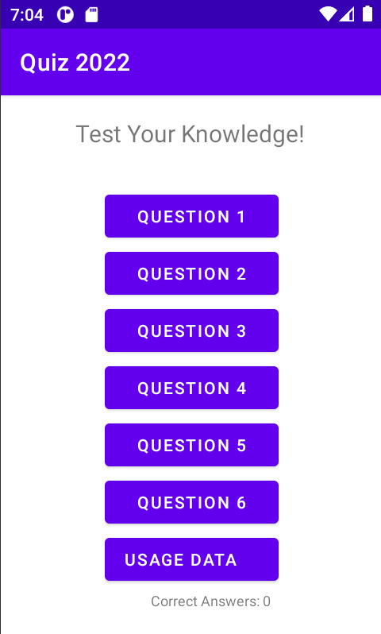
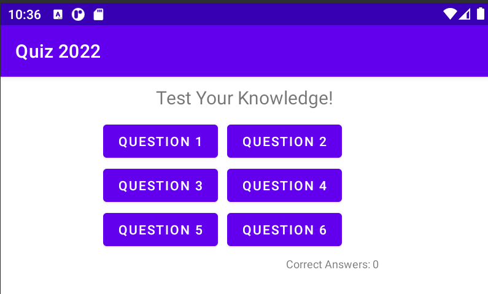
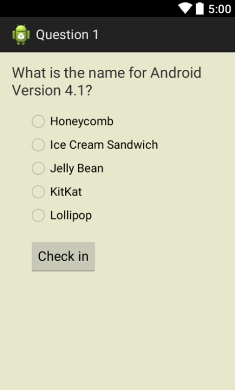

# README.md für Quiz 2022

## Was ist Quiz 2022
Ein Android-Studio-Projekt, das als Beispielapplikation für die native Android-Entwicklung
mit Java dient. Es stammt aus dem Kurs *Entwicklung mobiler Applikationen* des Schwerpunkts 
Medieninformatik von Prof. Roderus im Wintersemester 2022/2023 und wurde im Kurs
Schritt für Schritt weiter entwickelt.

## Wie ist dieses Projekt aufgebaut?
Dieses Github-Projekt stellt eine Art "Musterlösung" für diese App dar; für jede
Etappe der Entwicklung wird ein commit in GitHub durchgeführt, der hier dokumentiert wird. 
Auf diese Weise sollte es relativ leicht möglich sein, sich jederzeit bei einem bestimmten 
Entwicklungsstand wieder einzuklinken, falls das eigene Projekt nicht funktioniert.

## Etappe 1
Neu angelegtes Androidstudio-Projekt mit einer einzigen, leeren Activity 
(EmptyActivity mit Hello World) und diesem Readme.

## Etappe 2
- Die MainActivity wird durch Refactoring zur StartActivity und erhält ein eigenes Layout.
- Die Felder und Buttons werden vorerst alle in Englisch beschriftet.

## Etappe 3
- Die StartActivity erhält ein Landscape-Layout.

## Etappe 4
- Hard Coded Strings ersetzen durch String-Ressourcen
- Refactoring: Sinnvolle Namen (Identifier) für die UI-Elemente (optional)
- Lokalisierung für eine zweite Sprache (DE)

## Etappe 5
- Anlegen einer zweiten Activity für Frage 1 (Q1Activity, RadioGroup)

## Etappe 6
- Eventhandling für StartActivity implementieren (hier: onClick)
- Intent in StartActivity: Verzweigen zu Q1Activity

## Etappe 7
- FeedbackActivity implementieren: Reaktion auf Benutzerantwort
- Antwortinformation in Intent mitgeben

